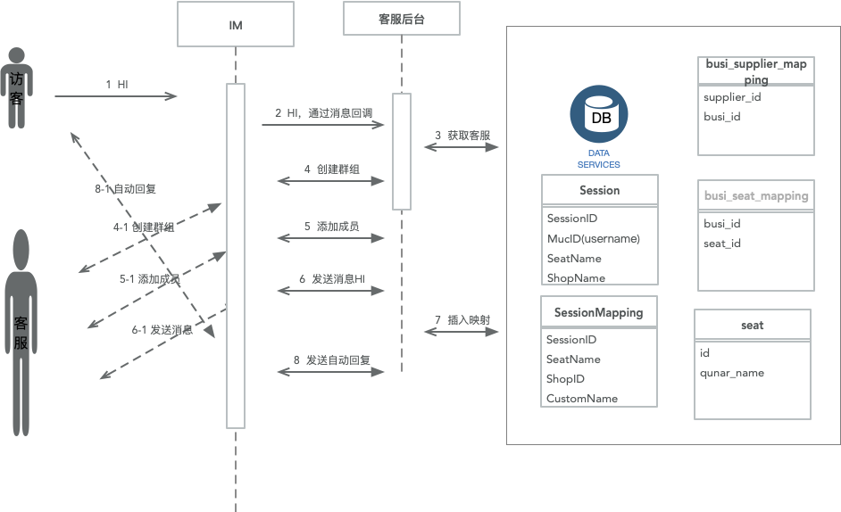
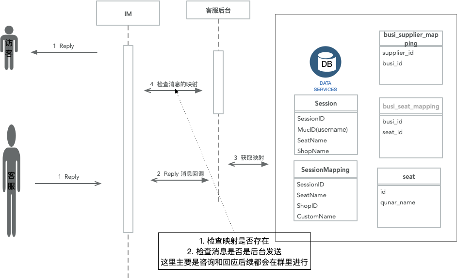

## 客服需求文档

### 客户端发起咨询

    <!-- 访客发起咨询的消息 -->
    <!-- 发出消息都服务端 -->
    <message type='consult' from='cc6213f74535459098d1fcfdb9a09e4b@dev.fsll.tech/web-107130861' to='shop_2@dev.fsll.tech' realfrom='cc6213f74535459098d1fcfdb9a09e4b@dev.fsll.tech' realto='test01@dev.fsll.tech' channelid='{"cn":"consult","d":"send","usrType":"usr"}' qchatid='4' isHiddenMsg='0' xmlns='jabber:client'><body msgType='1' maType='6' id='065B725706C54FDAB1E84CEAA8B08D2C'>1</body><active xmlns='http://jabber.org/protocol/chatstates'/></message>

    <!-- 服务端回应消息 -->
    <message xmlns='jabber:client' type='mstat' msec_times='1576139854109' to='cc6213f74535459098d1fcfdb9a09e4b@dev.fsll.tech'><body id='065B725706C54FDAB1E84CEAA8B08D2C' stat='sent'/></message>

    <!-- 服务端发回自动回复 -->
    <message xmlns='jabber:client' from='shop_2@dev.fsll.tech' to='cc6213f74535459098d1fcfdb9a09e4b@dev.fsll.tech' msec_times='1576139854139' realfrom='admin@dev.fsll.tech' realto='cc6213f74535459098d1fcfdb9a09e4b@dev.fsll.tech' type='consult' channelid='{&quot;d&quot;:&quot;recv&quot;,&quot;usrType&quot;:&quot;usr&quot;,&quot;cn&quot;:&quot;consult&quot;}' qchatid='5' auto_reply='true' no_update_msg_log='true'><body id='qcadmin23aaf77fc2304f208f385ee4531a37e4' msgType='1' maType='3'>张滨测试店铺</body><active/></message>

    <!-- 自动回复的已读标志 -->
    <message type='readmark' read_type='3' from='cc6213f74535459098d1fcfdb9a09e4b@dev.fsll.tech' to='test01@dev.fsll.tech' xmlns='jabber:client'><body msgType='1' maType='3'>[{&quot;id&quot;:&quot;qcadmin23aaf77fc2304f208f385ee4531a37e4&quot;}]</body></message>

客户端再次发起消息的请求，和第一个的请求是相同的

### 客服回应消息

    <!-- 客服回应消息 -->
    <message from="chao.zhang@qtalk" isHiddenMsg="0" to="shop_1@qtalk" type="chat" xmlns="jabber:client"><body id="E42169DEDDCC4D6FD6BB7E496D996704" maType="6" msgType="1">122233</body><active xmlns="http://jabber.org/protocol/chatstates"/></message>
    <!-- 服务端发送sent消息 -->
    <message xmlns='jabber:client' type='mstat' msec_times='1576142768367' to='chao.zhang@qtalk'><body id='E42169DEDDCC4D6FD6BB7E496D996704' stat='sent'/></message>

## 流程图如下所示

### 客户发起咨询

### 客服回应咨询

